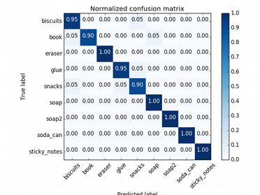

### Writeup / README

The perception pipeline for this project consists of the following steps:

#### 1. Filter Point Cloud
In this first step the point cloud message is read with the subscriber pcl_sub and then processed as follows:

* Voxel Grid Filtering: Downsampling of the point cloud (size of voxel grid defined with "leaf size" parameter. All points in a voxel are approximated with their centroid. This gives less points to consider for the rest of the perception pipeline.
* Pass Through Filter: Only Points within a certain space are considered. For this pipeline the z-axis is bounded between 0.6 and 1.1 m.
* Statistical Outlier Filter: is used to remove noise from the point cloud measurement. Therefore for each point the distance to its neighboring points (50 here) is computed. If the mean is greater than a previously defined threshold (0.01 here) the point is considered to be an outlier).

#### 2. Separate table from pick&place objects and cluster points for each object

* RANSAC table segmentation: The table is identified with the RANSAC algorithm. Next, two point clouds are generated - one for the table and the other for the objects on the table.
* Euclidian Clustering: With the function euclidian clustering the points from the "objects" cloud are segmented and a new cluster cloud is generated that contains all objects with individual colors. The result can be seen in the following figure:

#### 3. Train SVM to classify objects in pipeline and apply classifier to pipeline

* To train the classifier a feature set has to be recorded for each of the pick & place objects. This is done with the script "capture_features.py" (from exercise 3 project repo; the models list is adapted to the project requirements). With the script the objects are presented to a camera stick that records the respective point cloud for the object (for different aspect angles). From this point cloud then the features are extracted (which are color and surface normal histograms in this case). The code for this can be found in the file "features.py" from exercise 3.
* Next the classifier is trained with the script "train_svm.py" from the exercise 3 project repo. The normalized confusion matrix that is output by the script can be seen in the following figure:

The trained classifier is saved in the file "model.sav".

* When the perception pipeline is started this classifier is loaded and then applied to each element of the cluster point cloud. Therefore for each element of the cluster cloud the histograms for colors and surface normals are extracted and then the object class is predicted for this feature set.

* The labels that the classifier has identified are finally compared with the elements from the pick list and the pick position, place position, gripper arm name, etc. are saved to a .yaml file.

#### 4. Results and discussion
The result of the classifying operation for world 3 can be seen in the following figure.

It is evident that the classifier works well - except for objects that are heavily occluded (like the glue in this case). Here it could be helpful to move the robot to get an unobstructed view on the glue as well.

#### 4. Future Work
Next I could work on the pick & place part of the project where - with the pick list as basis - the robot actually grasps the obects and drops them in the respective boxes on the side of the robot.

Another interesting topic might be to replace the SVM classifier with a neural network. Here I would especially like to see if a cnn-like approach with filter kernels sliding over the point cloud data performs even better than the SVM (where - if I am correct? - the spatial information is not retained in the feature set).

